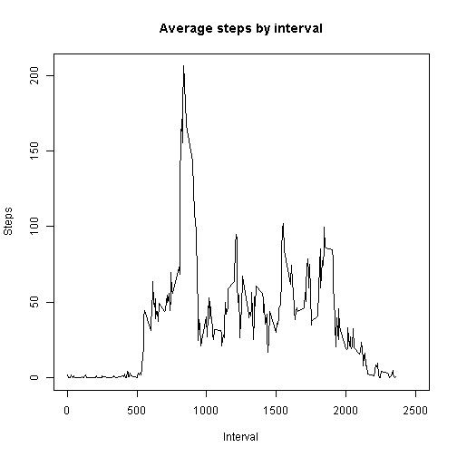

## Loading and preprocessing the data


```r
## Read in data
setwd("C:/Users/swojciechowski/Desktop/CourseraReproducibleResearch/RepData_PeerAssessment1/")
unzip("activity.zip")
activityDf <- read.csv("activity.csv")

## Load knitr package so knit2html() can be run from console
library(knitr)
```
## What is mean total number of steps taken per day?


```r
## Create total steps by date aggregate data frame
totStepsByDate <- aggregate(steps ~ date, activityDf, sum)
```
Below is a histogram of the data.


```r
## Plot histogram
hist(totStepsByDate$steps, col = "red", breaks = 20, xlim = c(0, 25000),
     main = "Total number of steps taken each day", xlab = "Total number of steps taken each day")
```

 

```r
## Calculate mean and median total number of steps taken per day, with NA's ignored
meanTotStepsByDate <- as.integer(round(mean(totStepsByDate$steps, na.rm = TRUE)))
medianTotStepsByDate <- median(totStepsByDate$steps, na.rm = TRUE)
```
The mean total number of steps taken per day is 10766, while the median total number of steps taken per day is 10765.

## What is the average daily activity pattern?

Below is a time series plot of the data.


```r
## Create aggregate data frame for average steps taken in 5-minute intervals
avgStepsByInterval <- aggregate(steps ~ interval, activityDf, mean)

## Plot time series
plot(avgStepsByInterval$interval, avgStepsByInterval$steps, type = "l", xlim = c(0, 2500),
     main = "Average steps by interval", xlab = "Interval", ylab = "Steps")
```

 

```r
## Calculate which 5-minute interval, on average, contains the maximum number of steps
maxStepInterval <- avgStepsByInterval$interval[avgStepsByInterval$steps == max(avgStepsByInterval$steps)]
maxIntervalSteps <- as.integer(round(max(avgStepsByInterval$steps)))
```
The 5-minute interval which, on average, features the greatest number of steps is 835, with the number of steps being 206.

## Imputing missing values


```r
## Calculate number of missing values
numMissingValues <- length(which(is.na(activityDf$steps)))
```
The total number of missing values in the original dataset is 2304.  These missing (step) values for each interval will be replaced using the mean values for those intervals, interval for interval.


```r
## Merge activityDf and avgStepsByInterval data frames
mergedDf <- merge(activityDf, avgStepsByInterval, by = "interval")

## Replace NA's with mean steps by interval values, interval for interval
for (i in 1:nrow(mergedDf)) {
  if (is.na(mergedDf[i, "steps.x"])) {
    mergedDf[i, "steps.x"] <- mergedDf[i, "steps.y"]
  }
}

## Create data frame with same structure as original, activityDf one by removing mean steps column ("steps.y")
## and re-naming "steps.x" column as "steps"
activityDf2 <- mergedDf[ ,c("interval", "steps.x", "date")]
colnames(activityDf2)[2] <- "steps"

## Create total steps by date aggregate data frame
totStepsByDate2 <- aggregate(steps ~ date, activityDf2, sum)
```
Below is a histogram of the data with NA's replaced with mean steps by interval values.


```r
## Plot histogram
hist(totStepsByDate2$steps, col = "red", breaks = 20, xlim = c(0, 25000), ylim = c(0, 20),
     main = "Total number of steps taken each day", xlab = "Total number of steps taken each day")
```

 

```r
## Calculate mean and median total number of steps taken per day, with NA's replaced
meanTotStepsByDate2 <- as.integer(round(mean(totStepsByDate2$steps)))
medianTotStepsByDate2 <- as.integer(round(median(totStepsByDate2$steps)))
```
The mean total number of steps taken per day is 10766, and the median total number of steps taken per day is also 10766.  So, replacing the missing values in the original activity dataset using the mean interval step values had no effect on the mean (when rounded to integer value), and increased the median by 1 (also when rounded to integer value).

## Are there differences in activity patterns between weekdays and weekends?

Below is a time series plot of the data, broken out by weekdays and weekend days.


```r
## Create a weekday / weekend factor variable ("dayType") in activityDf2 dataset
for (i in 1:nrow(activityDf2)) {
  if (weekdays(as.Date(activityDf2[i, "date"])) %in% c("Saturday", "Sunday")) {
    activityDf2[i, "dayType"] <- "Weekend"
  } else {
    activityDf2[i, "dayType"] <- "Weekday"
  }
}

## Convert dayType variable to class factor
activityDf2$dayType <- as.factor(activityDf2$dayType)

## Create average steps by interval and dayType aggregate data frame
avgStepsByIntervalAnddayType <- aggregate(steps ~ interval + dayType, activityDf2, mean)

## Load ggplot2 package and plot time series
library(ggplot2)
g <- ggplot(avgStepsByIntervalAnddayType, aes(interval, steps))
g + geom_line(color = "blue") + facet_grid(dayType ~ .) + labs(x = "Interval") + labs(y = "Number of steps") +
  theme_bw() + labs(title = "Average steps by interval") + xlim(0, 2500)
```

 
